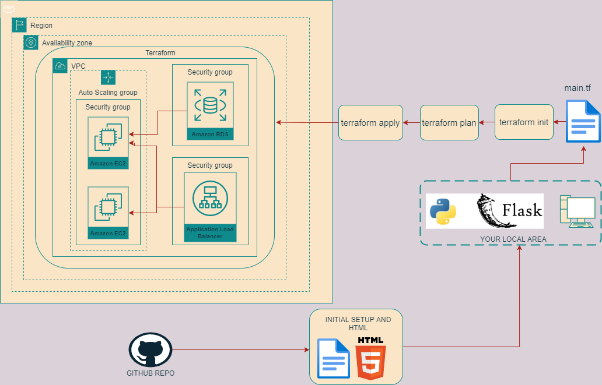
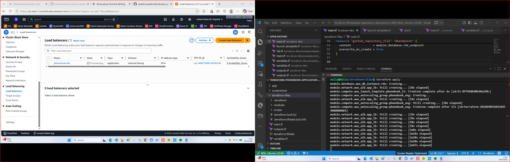
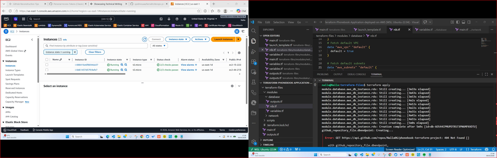

# Terraform-Phonebook-Application-deployed-on-AWS

### Project Overview

This project demonstrates a full-stack, hands-on cloud deployment of a Phonebook application using Python Flask and Terraform on AWS. The main goal is to showcase:

#### . Infrastructure as Code (IaC) using Terraform

#### . Modular design for network, compute, and database resources

#### . Deployment of a functional Python Flask application

#### . Cloud-native architecture features like Load Balancing and Auto Scaling
The project simulates a real-world scenario where a small application is deployed with best practices for cloud infrastructure.

Application Details

The Phonebook app is a simple web application built with Python and Flask. It allows users to:

#### . Add new contacts (name, phone number)

#### . View all contacts in a simple web interface

#### . Delete or update contacts

All the app code is stored in the app/ folder.

## Why Flask and Python?

Flask is lightweight and ideal for small web applications and lab projects.

Python provides simplicity and ease of integration with AWS resources and scripts.

## Infrastructure Overview


The infrastructure is designed using Terraform, with a modular approach for easier reuse and scalability.

### Folder Structure:
``` text
terraform-aws-phonebook-app/
│
├─ app/                       ← Python Flask application code
├─ terraform-files/            ← Terraform root and modules
│   ├─ main.tf                 ← Calls all modules and defines provider
│   ├─ variables.tf            ← Variables used across modules
│   ├─ outputs.tf              ← Outputs of deployed resources
    └─ scripts/                ← userdata to install
│   └─ modules/
│       ├─ network/            ← VPC, subnets, internet gateway
│       ├─ compute/            ← EC2 instances, Load balancer and auto-scaling group
│       ├─ database/           ← RDS setup for storing contacts
├─ screenshots/               ← Images showing deployed resources
└─ .gitignore                  ← Ignored files like .terraform, state

GitHub Repository
     │
     │ contains
     │
 ┌───────────────┐
 │ Terraform Code│
 └───────────────┘
        │
        │ creates
        ▼
 ┌──────────────────────┐
 │ AWS Infrastructure   │
 │                      │
 │ ALB                  │
 │ Auto Scaling Group   │
 │ EC2 Instances        │
 │ RDS MySQL            │
 └──────────────────────┘
        │
        │ EC2 runs
        ▼
   Docker Container
        │
        ▼
  Phonebook Python App

  
  